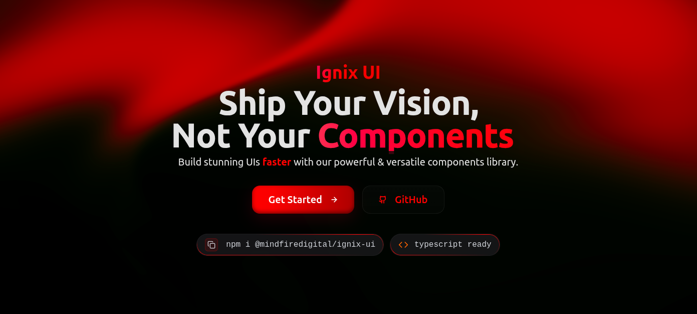

# Ignix UI



Ignix UI is your one-stop solution for modern frontend development. It is a modern, production-ready React UI system that helps ship beautiful, animated, and accessible interfaces fast. Built on top of Tailwind CSS, it streamlines the entire frontend workflow with a cohesive design system, powerful utilities, and developer‑first ergonomics.

Whether prototyping or scaling a large app, Ignix UI gives a polished foundation out of the box—so the focus stays on product, not plumbing.

## Why Ignix UI

- **Built for Speed**
  Opinionated defaults, smart APIs, and accessible by default components that accelerate development.

- **Design System Ready**
  Consistent design tokens, themes, and patterns that scale with your team's needs.

- **Built-in Animations**
  Fluid interactions with a built in motion layer no extra setup required.

- **Type-Safe**
  Built with TypeScript for rich, discoverable props and better IntelliSense support.

- **Tailwind-Native**
  Seamless integration with Tailwind CSS, featuring smart class merging that respects custom styles.

## Installation

### Install Package

```bash
# npm
npm install @mindfiredigital/ignix-ui

# yarn
yarn add @mindfiredigital/ignix-ui

# pnpm
pnpm add @mindfiredigital/ignix-ui
```

### Setup

1. Initialize the package:

```bash
npx @mindfiredigital/ignix-ui init
```

2. Add any components you need to your app.

```bash
npx @mindfiredigital/ignix-ui add <component-name>
```

## Documentation

For full documentation, visit [mindfiredigital.github.io/ignix-ui](https://mindfiredigital.github.io/ignix-ui/).

## Component Generator (For Contributors)

Ignix UI includes a **scaffolding script** that helps contributors quickly create new components with all the necessary boilerplate files.  
This ensures consistency, speeds up development, and keeps the project structure clean.

### Usage

Run the following command from the project root:

```bash
pnpm run generate-component --name=componentName
```

### What the Script Does

- Creates a new folder for your component.

- Adds base files (like .tsx, .test.tsx, index.tsx,).

- update registry.json.

- Ensures naming consistency.

## Contributing

Please follow our [contributing guidelines](https://mindfiredigital.github.io/ignix-ui/docs/contribution-guide/how-to-contribute).

## License

Licensed under the MIT License, Copyright © Mindfire Solutions
